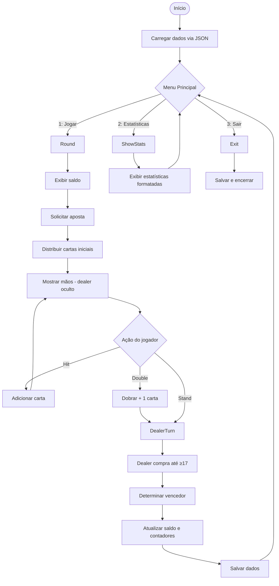

# Blackjack - Python - ItaJunior

> Jogo de BlackJack em Python com persistência de dados e estatísticas, desenvolvido como entregável do treinamento de Python da ITA Jr 2025.

---

## 📋 Sumário

1. Descrição
2. Funcionalidades
3. Tecnologias
4. Pré-requisitos
5. Instalação
6. Uso
7. Estrutura do Projeto
8. Fluxo de Execução
9. Aprendizados e Desafios
10. Contribuição
11. Licença
12. Autor

---

## 📖 Descrição

Este projeto implementa, em modo texto, um jogo de *BlackJack (21)* para um jogador contra o dealer.  
Você pode apostar, pedir carta, parar ou dobrar a aposta; o dealer segue regras fixas (compra até ter ≥ 17).  
Saldo, vitórias, derrotas e empates são gravados em JSON, permitindo retomar suas estatísticas entre sessões.

---

## ✨ Funcionalidades

- 🎮 **Jogar**: Hit, Stand, Double Down

- 💾 **Persistência**: salva `saldo`, `vitorias`, `derrotas` e `empates` em `saldo.json`
  
- 🂡 **Ás Inteligente**: tratamento de Ás como 11 ou 1 para evitar estourar 21

- 📊 **Estatísticas**: exibe saldo atual, total de jogos e taxa de vitória

- 📱 **Interface de terminal**: menu simples e responsivo  

---

## 🛠 Tecnologias

- **Linguagem**: Python 3.6+

- **Módulos padrão**: `json`, `random`, `os`
   
- **Opções de implementações futuras**:
    - GUI com `tkinter`
    - Banco de dados SQLite
    - Testes unitários com `pytest`

---

## 🚀 Pré-requisitos

- Python 3.6 ou superior

- (Opcional) Ambiente virtual (`venv` ou `virtualenv`)
   
- Permissão de leitura e escrita no diretório do projeto


---

## ⚙️ Instalação

```
# 1. Clone o repositório
git clone https://github.com/SEU_USUARIO/blackjack-itajr.git
cd blackjack-itajr

# 2. (Opcional) Crie e ative um ambiente virtual
python3 -m venv .venv
source .venv/bin/activate  # Linux/macOS
.venv\Scripts\activate     # Windows

# 3. (Opcional) Instale dependências
pip install -r requirements.txt
```

---

## 🎮 Uso

1. No terminal, execute:
```
 python main.py
```

2. No menu, escolha: 
    - `1` Jogar
    - `2` Ver estatísticas
    - `3` Sair

3. Siga os prompts para apostar e decidir suas jogadas.  

---

## 🗂 Estrutura do Projeto

```
blackjack-itajr/
├── dados.py        # Carregamento e persistência (JSON)
├── utils.py        # Lógica de cartas e cálculo de mão
├── main.py         # Loop principal e rotina de rodada
├── saldo.json      # Gerado em tempo de execução
└── README.md       # Documentação do projeto
```

---

## 🔄 Fluxo de Execução



---

## 🎓 Aprendizados e Desafios

- ✅ **Modularização**: separação clara em `dados.py`, `utils.py` e `main.py`.
    
- ✅ **Persistência**: uso de JSON (`json.load` / `json.dump`) e tratamento de arquivos.
    
- ✅ **Lógica de jogo**: algoritmo para cálculo de mão com Ás inteligente e regras do dealer.
    
- ✅ **Interação robusta**: `input().strip().lower()` para ler e normalizar comandos.
    
- ✅ **Testes incrementais**: uso de `if __name__ == "__main__":` para validar funções isoladas.
    
- 🐞 **Bugs resolvidos**: troca de `json.loads` por `json.load`, correção de “unhashable type” no conjunto de testes.
    

**Futuros aprimoramentos**: estratégia de apostas automática, sugestões de jogada por probabilidade e interface gráfica.

---

## 🤝 Contribuição

1. Fork este repositório
    
2. Crie uma branch (`git checkout -b feature/nome`)
    
3. Commit suas mudanças (`git commit -m "Mensagem clara"`)
    
4. Push para a branch (`git push origin feature/nome`)
    
5. Abra um Pull Request

---

## 👤 Autor

**Fernando Fernandes** – [Meu GitHub](https://github.com/fernandosfx) 
Treinamento em Python ITA Jr 2025
